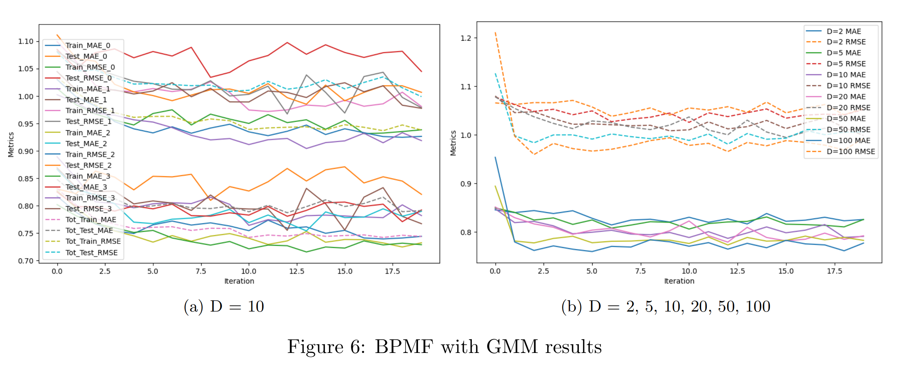

# Movie-Recommendation-System-using-MCMC-Methods
Project of Umich STATS 551: Bayesian statistics

Group Member: Xiaoyang Sheng, Yulin Gao, Zicong Xiao

The objective of this project is to forecast the user’s rating for a movie they have not yet watched, before recommendation, employing Bayesian inference, with a particular emphasis on Markov Chain Monte Carlo (MCMC) methods. 

For details, please refer to report.pdf

## Data

The MovieLens 20M Dataset, available via Kaggle (www.kaggle.com/datasets/grouplens/movielens-20m-dataset), encompasses a vast repository of 20,000,263 movie rating activities, across 27,278
movies, created by 138,493 customers, since 1995. The customers are selected at random for inclusion.

## Result

